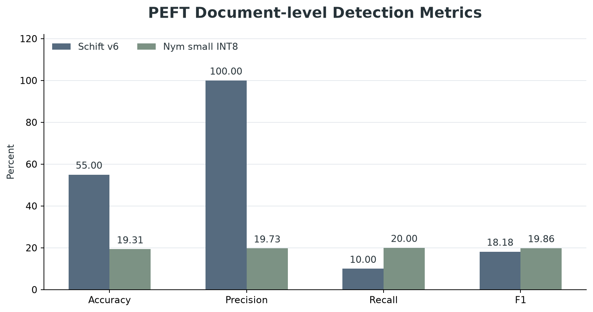
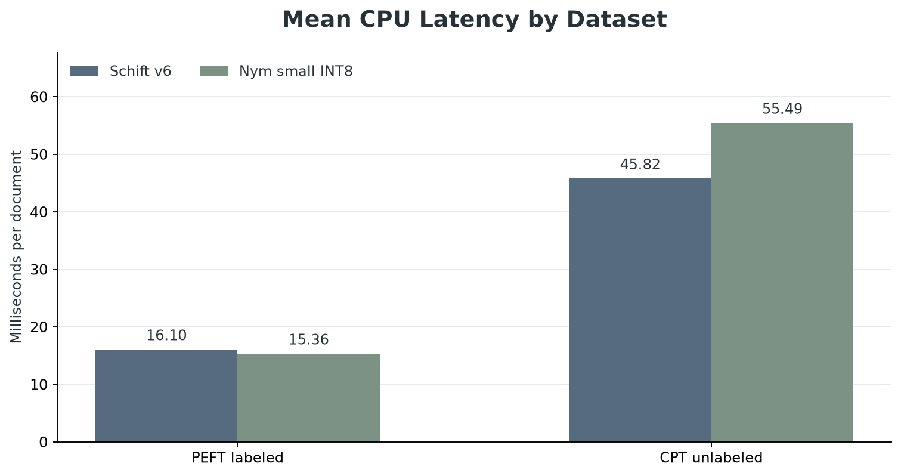
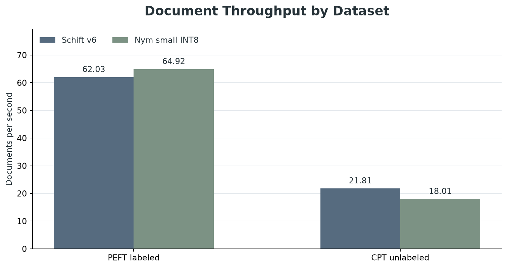
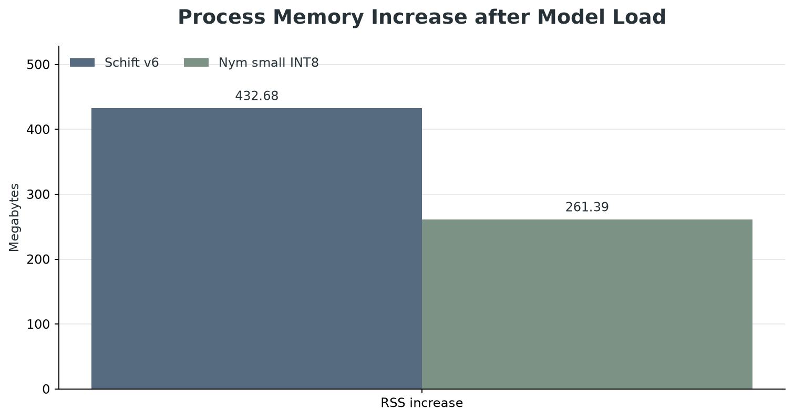
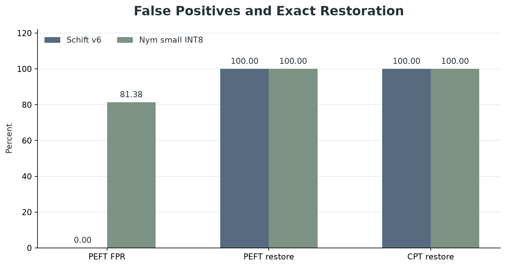

- 보고일: 2026-08-31
- 연구 분야: AI 모듈 연구
- 상태: 후보 모델 탐색 및 데이터 품질 점검 완료
- 평가 범위: 합성 문장 20,000건과 두 개의 소형 로컬 모델

연결 문서: [[플랫폼-평가/에이전트-kpi|자율 에이전트 KPI]]

## 한 줄 결론

**민감정보를 안전한 토큰으로 바꾸고 원문으로 복구하는 처리 흐름은 안정적으로 동작했지만, 현재 학습 문장의 표시 방식이 실제 개인정보와 달라 탐지 모델의 실전 정확도를 판단하기에는 부족했다.**

## 연구 질문

AI 에이전트가 외부 모델에 문장을 보내기 전에 개인정보를 찾아 가리고, 응답을 받은 뒤 원래 값으로 정확하게 복구하려면 어떤 역할을 모델과 소프트웨어가 각각 맡아야 할까?

## PII 모듈이란 무엇인가

PII는 개인을 식별할 수 있는 정보를 뜻한다. 이름, 전화번호, 주민등록번호, 계좌번호, 이메일 등이 대표적이다.

이 연구의 모듈은 다음 순서로 동작한다.

```text
문장에서 민감할 수 있는 구간 찾기
  → 문맥을 보고 실제 개인정보인지 판단
  → 원문을 충돌 없는 임시 토큰으로 바꾸기
  → 외부 AI 처리
  → 임시 토큰을 원래 값으로 정확히 복구
```

작은 로컬 모델은 “이 부분이 민감한가”를 판단하고, 실제 변환·복구는 규칙이 명확한 별도 소프트웨어 계층이 담당한다. 이 분리를 통해 모델이 원문을 임의로 바꾸거나 일부만 복구하는 문제를 줄였다.

## 실험 구성

- 개인정보 포함 여부를 판단하는 문장 10,000건
- 보안 문맥을 길게 구성한 문장 10,000건
- 두 개의 소형 로컬 후보 모델
- CPU 환경에서 한 건씩 처리

개인정보 포함 문장은 양성 5,000건과 음성 5,000건으로 균형을 맞췄다. 다만 양성 문장의 개인정보가 실제 전화번호나 계좌번호가 아니라 종류를 알려주는 합성 표시로 들어 있었다.

## 핵심 결과

### 후보 모델의 문서 단위 판단

| 지표 | 후보 A | 후보 B |
|---|---:|---:|
| 정확도 | **55.00%** | 19.31% |
| 정밀도 | **100.00%** | 19.73% |
| 재현율 | 10.00% | **20.00%** |
| 오탐률 | **0.00%** | 81.38% |

이 표의 “정확도”는 문장 안에서 하나 이상의 민감 구간을 출력했는지만 본 문서 단위 지표다. 개인정보의 정확한 시작·끝 위치를 맞혔는지는 평가하지 못했다.



### 처리 성능과 복구

- 두 모델 모두 20,000건을 오류 없이 처리했다.
- 짧은 문장에서는 두 후보의 처리량 차이가 크지 않았다.
- 긴 문장에서는 후보 A가 더 높은 처리량을 보였다.
- 모델이 선택한 구간을 토큰으로 바꾸고 복구하는 별도 계층은 20,000건 모두 원문 일치율 100%를 기록했다.






## 가장 중요한 발견

후보 모델의 숫자보다 데이터 구성의 문제가 더 중요했다. 양성 문장에 실제 개인정보 형태가 아니라 종류가 드러나는 합성 표시를 넣었기 때문에, 모델이 실생활의 전화번호·계좌번호·주민등록번호 경계를 찾는 능력을 검증하지 못했다.

후보 A의 오탐률이 낮고 후보 B의 재현율이 더 높다는 관측은 가능하지만, 이 데이터만으로 어느 모델이 실제 환경에서 더 정확하다고 결론 내릴 수 없다. 현재 결과는 모델 선정의 최종 판정이 아니라 데이터셋을 어떻게 고쳐야 하는지 보여주는 탐색 실험이다.

## 설계상 얻은 결론

1. 민감정보 판단과 원문 복구를 한 모델에 모두 맡기지 않는다.
2. 모델은 민감 여부와 유형을 판단하고, 토큰 생성·보관·복구는 결정적인 소프트웨어 계층이 담당한다.
3. 모델 평가에는 실제 형식을 닮았지만 실존 인물과 무관한 안전한 합성값이 필요하다.
4. 문장 단위 정답뿐 아니라 각 민감 구간의 시작·끝 위치와 유형 정답을 함께 만들어야 한다.

## 한계와 주의사항

- 실제 개인정보를 사용하지 않았으며, 현재 합성 표시도 실제 개인정보 형태를 충분히 재현하지 못했다.
- 100% 복구율은 모델의 탐지 정확도가 아니라 별도 토큰 매핑 계층의 정확성을 뜻한다.
- CPU 한 종류와 제한된 실행 조건에서 측정했으므로 다른 장비의 속도를 대표하지 않는다.
- 실제 배포 전에는 안전한 합성 개인정보와 사람이 검수한 구간 정답으로 다시 평가해야 한다.
