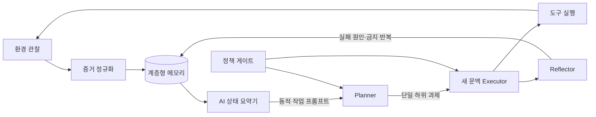

- 보고일: 2026-08-31
- 상태: 격리 환경 탐색 실험 완료, 재현 실험 설계 중
- 평가 범위: 의도적으로 취약하게 만든 소유·허가된 실습 환경

연결 문서: [[에이전트/보안/blue-team|BLUE Team]] · [[에이전트/보안/dynamic-honeypot|Dynamic Honeypot]] · [[rag-컨텍스트/하이브리드-검색|RAG]] · [[플랫폼-평가/에이전트-kpi|KPI]]

## 초록

장기 모의해킹 과제에서 언어 모델은 개별 도구 사용에는 성공해도 전체 목표, 이미 검증한 사실, 실패한 경로를 한 문맥에서 오래 유지하지 못한다. 본 문서는 이 문제를 모델 지식의 부족이 아니라 **오케스트레이션과 기억 관리의 실패**로 보고, 동적 AI-to-AI 프롬프팅, Planner–Executor 역할 분리, 계층형 메모리 관리, 증거 그래프를 결합한 구조를 기술한다. 기존 탐색 실험에서는 평면 문맥보다 계층형 기억에서 문맥 소실이 줄었고, 현재 상태로 다음 지시를 다시 생성하는 구조에서 과제 완수가 증가했다. 다만 공개된 집계표만으로 반복 수와 신뢰구간을 재구성할 수 없으므로 이 결과는 확정적 우월성의 증거가 아니라 후속 통제 실험을 위한 관측으로 해석한다.

## 한 줄 결론

**긴 실행 기록을 그대로 누적하는 것보다, 증거를 계층별로 보존하고 한 AI가 다른 AI의 다음 작업 프롬프트를 현재 상태에 맞춰 생성하도록 했을 때 장기 목표 유지가 개선되었다.**

## 연구 질문

1. 동일한 기반 모델에서 평면 대화 기록을 계층형 기억으로 바꾸면 문맥 소실과 반복 행동이 줄어드는가?
2. 사람이 작성한 고정 프롬프트 대신 AI가 관찰 증거로 다음 AI의 작업 지시를 생성하면 과제 완수와 최초 성과 시간이 개선되는가?
3. 개선이 모델 변경이 아니라 프롬프팅·기억·역할 분리에서 비롯됐음을 절제 실험으로 구분할 수 있는가?

## 관련 연구

PentestGPT는 모의해킹을 세 개의 자기상호작용 모듈로 분리해 전체 문맥 유지 실패를 완화했고, 단일 GPT-3.5 대비 과제 완수가 증가했다고 보고했다 [1]. 본 설계는 여기서 **장기 목표와 도구 실행 문맥을 분리해야 한다**는 문제 정의를 가져왔다.

ReAct는 추론과 환경 행동을 번갈아 수행해 계획 갱신과 예외 처리를 가능하게 했다 [2]. Reflexion은 실패 피드백을 언어 형태의 에피소드 기억으로 남겨 다음 시도의 정책을 바꾸었다 [3]. 본 설계의 행동 루프와 실패 요약은 각각 이 두 흐름과 맞닿아 있다.

MemGPT는 제한된 컨텍스트 창을 운영체제의 가상 메모리처럼 여러 계층으로 관리한다 [4]. AriGraph는 에피소드 기억과 의미 기억을 그래프로 결합해 계획에 사용한다 [5]. 본 설계는 이를 보안 과제에 맞게 임무, 단계, 증거, 최근 행동으로 구체화하되, 모델 가중치를 갱신하지 않고 외부 상태 저장소만 사용한다.

EnIGMA는 디버거·서버 연결처럼 실제 상호작용 도구가 보안 과제 성능에 중요하며, 모델이 도구를 실행하지 않고 관찰을 지어내는 현상도 평가해야 함을 보였다 [6]. 따라서 본 시스템은 명령 출력, 파일 해시, 서비스 응답처럼 외부에서 검증 가능한 증거가 없는 성공 주장을 완료로 인정하지 않는다.

D-CIPHER는 Auto-prompter, Planner, 이기종 Executor를 분리한다. Auto-prompter가 환경을 탐색해 초기 프롬프트를 생성하고, Planner는 전체 계획을 유지하며, Executor는 매 작업마다 새로운 대화 문맥에서 단일 하위 과제에 집중한다 [7]. 본 설계는 이 아이디어를 직접 구현체로 재사용한 것이 아니라 다음 두 방향으로 변형했다.

- 초기 한 번의 Auto-prompter가 아니라 **매 단계마다** 상태 요약기가 다음 Executor용 지시를 다시 작성한다.
- Executor의 자연어 요약만 신뢰하지 않고, 반환값을 증거 ID와 공격 그래프 노드에 연결해야 Planner 기억으로 승격한다.

Cybench와 AutoPenBench는 최종 성공만으로는 진행 정도를 설명하기 어려워 하위 과제나 마일스톤을 사용한다 [8, 9]. 본 문서의 공격 깊이와 취약점 활용률도 같은 문제의식에서 출발하지만, 수치 자체를 이 외부 벤치마크와 직접 비교하지 않는다.

## 방법론

### 시스템 개요

Planner는 전체 목표와 미해결 가설의 우선순위를 유지한다. Executor는 하나의 하위 과제만 받아 도구를 실행한다. 상태 요약기는 메모리에서 현재 단계에 필요한 정보만 골라 다음 역할의 프롬프트를 만든다. Reflector는 실패를 단순 문자열이 아니라 실패 원인, 적용 조건, 재시도 금지 조건으로 정규화한다.

### 동적 AI-to-AI 프롬프팅

동적 AI-to-AI 프롬프팅은 사람이 미리 작성한 긴 템플릿을 모든 단계에 반복 주입하는 방식이 아니다. **상태 요약 AI가 실행 증거를 읽고, 다음 역할 AI가 바로 실행할 수 있는 작업 계약을 생성하는 과정**이다. 생성 프롬프트는 다음 필드를 가진다.

| 필드 | 내용 | 목적 |
|---|---|---|
| 목표 | 이번 턴에서 검증할 단일 가설 | 범위 팽창 방지 |
| 알려진 사실 | 증거 ID가 있는 관찰만 포함 | 환각된 상태 전파 방지 |
| 금지 반복 | 이미 실패했고 조건이 변하지 않은 행동 | 루프 억제 |
| 허용 도구·대상 | 정책 게이트가 승인한 범위 | 안전 경계 유지 |
| 성공 조건 | 파일, 응답, 상태 변화 등 검증 가능한 종료 조건 | 주장과 성과 분리 |
| 반환 계약 | 결과, 증거 ID, 불확실성, 다음 가설 | Planner가 비교 가능한 형태로 수신 |

고정 프롬프트와의 차이는 문구의 다양성이 아니라 **입력 상태에 따라 목표와 증거 집합이 바뀐다는 것**이다. 프롬프트 생성기는 새로운 공격 사실을 창작할 권한이 없으며, 메모리에 존재하는 증거를 선택·압축·배열하는 역할만 맡는다.

### 계층형 메모리 관리

메모리는 시간순 대화 한 덩어리가 아니라 수명과 추상도가 다른 네 계층으로 나뉜다.

| 계층 | 저장 내용 | 갱신·삭제 규칙 | 프롬프트 포함 조건 |
|---|---|---|---|
| M0 임무 기억 | 목표, 대상 범위, 금지 행동, 성공 조건 | 실행 중 불변 | 모든 Planner 턴 |
| M1 전략 기억 | 현재 공격 단계, 활성 가설, 우선순위, 남은 하위 과제 | Planner가 증거를 근거로 갱신 | 현재 단계와 직접 관련될 때 |
| M2 증거 기억 | 명령 출력, 서비스 응답, 취약점–행동 관계, 증거 ID | 검증된 관찰만 추가; 모순은 두 항목 모두 보존 | 검색 점수와 그래프 홉으로 선택 |
| M3 작업 기억 | 최근 행동, 임시 계산, 도구 오류 | 고정 길이 창을 넘으면 요약 후 만료 | 해당 Executor 세션만 |

M3의 관찰이 검증되면 M2로 승격되고, 여러 증거가 같은 가설을 지지할 때만 M1 전략이 바뀐다. 실패 기록은 무조건 영구 보존하지 않는다. 대상 상태나 입력 조건이 같을 때만 재시도 금지 규칙으로 유지하고, 조건이 바뀌면 다시 후보가 될 수 있다. 상세한 희소·밀집 검색과 2-hop 실험은 [[rag-컨텍스트/하이브리드-검색|RAG 문서]]에서 다룬다.

### 증거 기반 종료

Executor의 “성공했다”는 자연어 응답은 성공이 아니다. 과제 완료는 사전에 정한 검증기가 성공 조건을 확인했을 때만 기록한다. 검증기는 실행 종료 코드, 기대 문자열, 파일 상태, 서비스 상태 변화 중 과제에 맞는 하나 이상을 사용한다. 근거 없는 자기 보고는 실패가 아니라 **미검증** 상태로 남겨 후속 검사를 요구한다.

### 안전 경계

모든 실행은 소유·허가된 격리 환경에 한정한다. 대상, 네트워크 범위, 도구, 최대 실행 시간은 M0 임무 기억과 별도의 정책 엔진에 중복 저장한다. 정책 엔진은 LLM이 수정할 수 없고, 범위를 벗어난 제안은 도구 호출 전에 차단한다. 세부 산식은 [[플랫폼-평가/에이전트-kpi#안전-통제|안전 통제]]에 정의한다.

## 실험 설계

독립변수는 기반 모델이 아니라 오케스트레이션 구성이다. 같은 과제 집합, 모델, 온도, 도구, 시간 제한을 고정하고 다음 변형을 비교한다.

| 변형 | 평면 기록 | 계층형 메모리 | 동적 AI-to-AI | 증거 그래프 |
|---|:---:|:---:|:---:|:---:|
| B0 단일 루프 | ✓ | — | — | — |
| B1 기억 분리 | — | ✓ | — | — |
| B2 동적 프롬프트 | — | ✓ | ✓ | — |
| B3 전체 구조 | — | ✓ | ✓ | ✓ |

주 평가지표는 과제 완수율이다. 보조지표는 취약점 활용률, 정규화 공격 깊이, 최초 검증 성과 시간, 문맥 소실 횟수, 동일 행동 반복률이다. 각 정의와 산식은 [[플랫폼-평가/에이전트-kpi#red-공격|RED 공격 KPI]]를 따른다. 후속 재현 실험은 과제 순서를 무작위화하고 변형별 동일 횟수로 반복하며, 완수율의 원시 분자·분모와 95% 신뢰구간을 공개해야 한다.

## 절제 실험

탐색 단계의 25개 과제 기록에서는 B0가 2개, B1이 10개, B2가 25개를 완료한 것으로 집계됐다. 문맥 소실은 B0의 17회에서 B1의 4회로 감소했다. 이 비교는 계층형 기억과 동적 프롬프트가 순차적으로 추가된 결과이므로 어떤 구성요소가 얼마를 기여했는지 완전히 분리하지 못한다.

별도의 40개 과제 환경에서 기록된 기준·최종 구조 집계는 다음과 같다. 25개 과제와 난이도 및 구성이 다르므로 두 표를 하나의 학습 곡선으로 연결하지 않는다.

| 지표 | 기준 구조 | 최종 구조 | 차이 |
|---|---:|---:|---:|
| 과제 완수율 | 27.5% | **70.3%** | +42.8%p |
| 발견 취약점 활용률 | 29.1% | **77.6%** | +48.5%p |
| 정규화 공격 깊이 | 28.8% | **59.3%** | +30.5%p |
| 최초 성과 속도 점수 | 74 | **93** | +19 |
| 반복 실행 편차 | 미측정 | **1.2** | 비교 불가 |

위 40개 과제 표는 기존 실험 기록의 집계값이다. 현재 공개 자료에는 과제별 원시 결과, 반복 횟수, 속도 점수의 변환식이 포함되어 있지 않아 독립적으로 재계산하거나 통계적 유의성을 검정할 수 없다. 따라서 표는 **탐색적 관측**으로만 남기며, 재현 실험 전에는 “성능 향상을 입증했다”는 결론에 사용하지 않는다.

## 결과 해석

관측된 개선의 가장 설득력 있는 설명은 새로운 공격 지식의 추가보다 정보 흐름의 변화다. 평면 기록에서는 오래된 성공·실패와 현재 목표가 같은 우선순위로 섞였고, 계층형 구조에서는 불변 임무와 일시적 작업 기록을 분리했다. 동적 프롬프팅은 이 메모리를 다음 Executor가 실행할 수 있는 한정된 작업 계약으로 변환했다.

그러나 B2에서 여러 요소가 동시에 바뀌었고 원시 로그가 공개되지 않았으므로 인과 효과를 단정할 수 없다. D-CIPHER가 보고한 Auto-prompter 효과 역시 모델과 벤치마크에 따라 달라졌으므로 [7], 본 구조에서도 Auto-prompter 유무, 새 Executor 문맥 유무, 계층형 메모리 유무를 독립적으로 제거하는 절제가 필요하다.

## 한계와 타당성 위협

- **내적 타당성:** 기억, 프롬프트, 역할 분리가 동시에 바뀐 실험은 개별 효과를 분리하지 못한다.
- **구성 타당성:** “최초 성과 속도 점수”의 변환식이 공개되지 않아 시간 지표로 재현할 수 없다.
- **외적 타당성:** 자체 격리 과제의 결과를 실제 조직망이나 다른 CTF 벤치마크로 일반화할 수 없다.
- **통계적 타당성:** 원시 분자·분모와 반복별 결과가 없어 신뢰구간 및 유의성 검정을 제공하지 못한다.
- **모델 교란:** 단일 모델 결과만으로 오케스트레이션 효과가 모델군 전체에 유지된다고 말할 수 없다.
- **안전 범위:** 실제 시스템 공격이나 무단 침투를 평가하지 않았으며, 그런 사용을 허용하지 않는다.

## 참고문헌

1. Deng et al., “PentestGPT: Evaluating and Harnessing Large Language Models for Automated Penetration Testing,” USENIX Security 2024. [원문](https://www.usenix.org/conference/usenixsecurity24/presentation/deng) (확인일: 2026-08-31)
2. Yao et al., “ReAct: Synergizing Reasoning and Acting in Language Models,” ICLR 2023. [원문](https://arxiv.org/abs/2210.03629) (확인일: 2026-08-31)
3. Shinn et al., “Reflexion: Language Agents with Verbal Reinforcement Learning,” 2023. [원문](https://arxiv.org/abs/2303.11366) (확인일: 2026-08-31)
4. Packer et al., “MemGPT: Towards LLMs as Operating Systems,” 2023. [원문](https://arxiv.org/abs/2310.08560) (확인일: 2026-08-31)
5. Anokhin et al., “AriGraph: Learning Knowledge Graph World Models with Episodic Memory for LLM Agents,” 2024. [원문](https://arxiv.org/abs/2407.04363) (확인일: 2026-08-31)
6. Abramovich et al., “Interactive Tools Substantially Assist LM Agents in Finding Security Vulnerabilities,” 2024. [원문](https://arxiv.org/abs/2409.16165) (확인일: 2026-08-31)
7. Udeshi et al., “D-CIPHER: Dynamic Collaborative Intelligent Agents with Planning and Heterogeneous Execution for Enhanced Reasoning in Offensive Security,” 2025. [원문](https://arxiv.org/abs/2502.10931) (확인일: 2026-08-31)
8. Zhang et al., “Cybench: A Framework for Evaluating Cybersecurity Capabilities and Risks of Language Models,” ICLR 2025. [원문](https://openreview.net/forum?id=tc90LV0yRL) (확인일: 2026-08-31)
9. Gioacchini et al., “AutoPenBench: Benchmarking Generative Agents for Penetration Testing,” 2024. [원문](https://arxiv.org/abs/2410.03225) (확인일: 2026-08-31)
